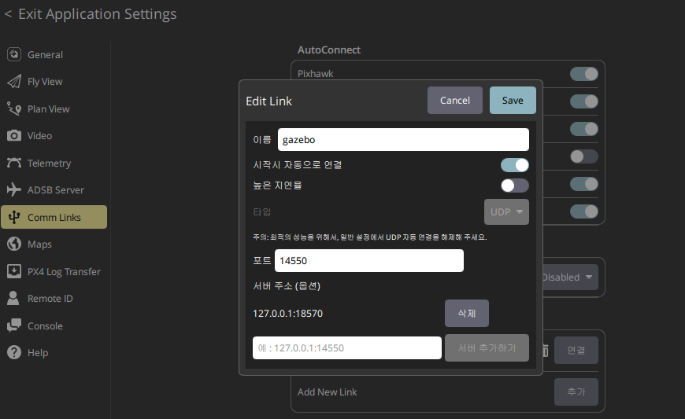

# PSI VTOL Team Drone Stack

PX4 SITL, Gazebo, ROS2 mission control, vision pipeline, and MuJoCo RL workspace for the PSI VTOL project.

Current working branch:

```bash
orange-fix
```

---

## 1. What this repository contains

```text
drone_stack/
├── compose.yaml
├── start.sh
├── px4/
│   ├── Dockerfile
│   ├── entrypoint.sh
│   └── PX4-Autopilot/        # external dependency, not tracked by this repo
├── px4_assets/
│   └── worlds/               # custom Gazebo worlds
├── models/                   # custom Gazebo models
├── ros2/
│   ├── Dockerfile
│   ├── entrypoint.sh
│   └── ws/src/
│       ├── drone_control/
│       ├── drone_vision/
│       ├── drone_interfaces/
│       ├── drone_bringup/
│       └── px4_msgs/
└── mujoco_rl/
```

Important rule:

```text
px4/PX4-Autopilot/ is treated as an external dependency.
Do not store project-specific files only inside px4/PX4-Autopilot/.
```

Project-specific files should be stored in this repository, for example:

```text
px4_assets/worlds/
models/
px4/patches/
ros2/ws/src/
```

---

## 2. Required PX4 and ROS2 message versions

The current ROS2 mission code expects PX4 1.15-style unversioned topics:

```text
/fmu/out/vehicle_status
/fmu/out/vehicle_local_position
/fmu/in/trajectory_setpoint
/fmu/in/offboard_control_mode
```

Do not use PX4 `main` unless the ROS2 topic names are updated. PX4 `main` may produce versioned topics such as:

```text
/fmu/out/vehicle_status_v4
/fmu/out/vehicle_local_position_v1
```

checking command

```text
docker exec -it ros2-vision bash -lc '
cd /workspace/ros2/ws
source /opt/ros/humble/setup.bash
source install/setup.bash

echo "PX4 output topics:"
ros2 topic list | grep -E "^/fmu/out/vehicle_status|^/fmu/out/vehicle_local_position"

echo ""
echo "PX4 input topics:"
ros2 topic list | grep -E "^/fmu/in/trajectory_setpoint|^/fmu/in/offboard_control_mode"
'
```

Recommended PX4 version:

```text
PX4 branch: release/1.15
PX4 commit: 85df8c2281
Expected describe: v1.15.4-4-g85df8c2281-dirty
```

Set PX4 to the expected version:

```bash
cd ~/drone_stack/px4/PX4-Autopilot

git fetch origin
git checkout -B release/1.15 origin/release/1.15
git checkout 85df8c2281

git rev-parse --short HEAD
git describe --tags --always --dirty
```

Set `px4_msgs` to the matching release:

```bash
cd ~/drone_stack/ros2/ws/src/px4_msgs

git fetch origin --no-recurse-submodules
git checkout -B release/1.15 origin/release/1.15
```

If permission errors occur:

```bash
cd ~/drone_stack

sudo chown -R $(id -u):$(id -g) px4/PX4-Autopilot
sudo chown -R $(id -u):$(id -g) ros2/ws/src/px4_msgs
```

---

## 3. First-time startup

From the host WSL terminal:

```bash
cd ~/drone_stack

docker compose build
./start.sh
```

Use:

```bash
./start.sh
```

instead of:

```bash
docker compose up
```

`start.sh` sets the host IP required for QGroundControl communication.

Expected running containers:

```bash
docker ps --format "table {{.Names}}\t{{.Status}}\t{{.Ports}}"
```

Expected:

```text
px4-gazebo        Up
microxrce-agent   Up
ros2-vision       Up
```

---

## 4. QGroundControl connection

Use a manual UDP link in QGroundControl:

<p align="center">
  
</p>

```text
Type: UDP
Listening Port: 14550
Server Address: 127.0.0.1:18570
```

`127.0.0.1:18570` is the default example for this Docker/WSL setup.

The server address can be different depending on the user's network, WSL, Docker, and QGroundControl environment.  
For example, in one tested setup, the server address was:

```text
179.0.0.21:18570
```

Useful PX4 status check:

```bash
docker exec -it ros2-vision bash -lc '
cd /workspace/ros2/ws
source /opt/ros/humble/setup.bash
source install/setup.bash

ros2 topic echo /fmu/out/vehicle_status --once
'
```

Useful fields:

```text
arming_state
nav_state
failsafe
gcs_connection_lost
pre_flight_checks_pass
is_vtol
```

---

## 5. Build the ROS2 workspace

Enter the ROS2 container:

```bash
docker exec -it ros2-vision bash
```

Build:

```bash
cd /workspace/ros2/ws

source /opt/ros/humble/setup.bash

touch src/my_first_pkg/COLCON_IGNORE

colcon build

source install/setup.bash
```

Do not use `--symlink-install` in the current container environment if it fails with:

```text
error: option --editable not recognized
```

Use regular `colcon build`.

Check packages:

```bash
ros2 pkg list | grep drone
```

Expected packages include:

```text
drone_control
drone_vision
drone_interfaces
drone_bringup
```

---

## 6. Launch the mission system

Inside the `ros2-vision` container:

```bash
cd /workspace/ros2/ws

source /opt/ros/humble/setup.bash
source install/setup.bash

export PYTHONOPTIMIZE=1

ros2 launch drone_control mission_system.launch.py
```

This launch starts:

```text
setpoint_mux
mission_manager
generator_tracking
vertiport_tracking
yolo_detector
target_depth_estimator
target_camera_to_ned
```

Do not run a second `yolo_detector` manually while `mission_system.launch.py` is already running, unless doing a standalone detector test.

---

## 7. Camera bridge

Gazebo camera topics are not automatically ROS2 topics. Start the ROS-Gazebo bridge in a separate terminal:

```bash
docker exec -it ros2-vision bash

cd /workspace/ros2/ws
source /opt/ros/humble/setup.bash
source install/setup.bash

ros2 run ros_gz_bridge parameter_bridge \
  /vtol/camera@sensor_msgs/msg/Image@gz.msgs.Image \
  /vtol/camera_info@sensor_msgs/msg/CameraInfo@gz.msgs.CameraInfo \
  /vtol/depth@sensor_msgs/msg/Image@gz.msgs.Image
```

Check Gazebo-side topics:

```bash
docker exec -it px4-gazebo bash -lc '
gz topic -l | grep -E "vtol|camera|depth"
'
```

Expected:

```text
/vtol/camera
/vtol/camera_info
/vtol/depth
/vtol/depth/points
```

Check ROS2 camera rate:

```bash
ros2 topic hz /vtol/camera
```

Expected rate is usually about:

```text
8-10 Hz
```

---

## 8. Mission test sequence

Use three terminals.

### Terminal 1: camera bridge

```bash
docker exec -it ros2-vision bash

cd /workspace/ros2/ws
source /opt/ros/humble/setup.bash
source install/setup.bash

ros2 run ros_gz_bridge parameter_bridge \
  /vtol/camera@sensor_msgs/msg/Image@gz.msgs.Image \
  /vtol/camera_info@sensor_msgs/msg/CameraInfo@gz.msgs.CameraInfo \
  /vtol/depth@sensor_msgs/msg/Image@gz.msgs.Image
```

### Terminal 2: mission system

```bash
docker exec -it ros2-vision bash

cd /workspace/ros2/ws
source /opt/ros/humble/setup.bash
source install/setup.bash

export PYTHONOPTIMIZE=1

ros2 launch drone_control mission_system.launch.py
```

### Terminal 3: command and monitor

```bash
docker exec -it ros2-vision bash

cd /workspace/ros2/ws
source /opt/ros/humble/setup.bash
source install/setup.bash
```

Start the mission:

```bash
ros2 topic pub --once /mission/start std_msgs/msg/String "{data: 'START'}"
```

Force rescue-done transition for mission-state testing:

```bash
ros2 topic pub --once /mission/rescue_status std_msgs/msg/String "{data: 'RESCUE_DONE'}"
```

Monitor mission state:

```bash
ros2 topic echo /mission/status
ros2 topic echo /setpoint_mux/status
ros2 topic echo /generator_tracking/status
```

Monitor PX4 setpoints:

```bash
ros2 topic echo /fmu/in/offboard_control_mode --once
ros2 topic echo /fmu/in/trajectory_setpoint --once
```

Monitor vision:

```bash
ros2 topic echo /vision/yolo_bbox
ros2 topic echo /vision/target_camera_xyz
ros2 topic echo /target/ned
```

Open image viewer if GUI support is available:

```bash
ros2 run rqt_image_view rqt_image_view
```

Useful image topics:

```text
/vtol/camera
/vision/yolo_annotated_image
/vtol/depth
```

---

## 9. Vision model files

YOLO model files are not tracked by Git.

Do not commit files such as:

```text
*.pt
*.pth
*.onnx
*.engine
*.tflite
```

Required mission model:

```text
ros2/ws/src/drone_vision/models/aruco_best.pt
```

Inside the container, the same path is:

```text
/workspace/ros2/ws/src/drone_vision/models/aruco_best.pt
```

Current mission model:

```text
aruco_best.pt
class 0: yolo-marker
```

Standalone YOLO test:

```bash
ros2 run drone_vision yolo_detector --ros-args \
  -p model_path:=/workspace/ros2/ws/src/drone_vision/models/aruco_best.pt \
  -p confidence_threshold:=0.25 \
  -p target_class_id:=0
```

Check model files:

```bash
ls -lh /workspace/ros2/ws/src/drone_vision/models/
```

Check YOLO class names:

```bash
python3 - <<'PY'
from ultralytics import YOLO

model = YOLO("/workspace/ros2/ws/src/drone_vision/models/aruco_best.pt")
print(model.names)
PY
```

Expected:

```text
{0: 'yolo-marker'}
```

---

## 10. Interpreting YOLO output

Example invalid detection:

```text
[0.0, -1.0, 0.0, 0.0, 0.0, 0.0, 0.0, 640.0, 480.0]
```

Meaning:

```text
valid = 0.0
class_id = -1.0
confidence = 0.0
image size = 640 x 480
```

This means:

```text
Camera input is working.
YOLO node is running.
The target is not detected.
```

When detection is valid:

```text
valid = 1.0
```

Only then should downstream topics publish meaningful data:

```text
/vision/target_camera_xyz
/target/ned
```

---

## 11. Troubleshooting

### Problem: `/fmu` topics do not appear

Check containers:

```bash
docker ps --format "table {{.Names}}\t{{.Status}}\t{{.Ports}}"
```

Check MicroXRCEAgent logs:

```bash
docker logs --tail 100 microxrce-agent
```

If the log only shows:

```text
running... port: 8888
```

and does not show `create_topic` or `create_datawriter`, PX4 is probably not connecting to the agent.

Check the patched `rcS` line:

```bash
docker exec -it px4-gazebo bash -lc '
grep -n "uxrce_dds_client start" /workspace/px4/PX4-Autopilot/ROMFS/px4fmu_common/init.d-posix/rcS
'
```

Correct:

```text
uxrce_dds_client start -t udp -h microxrce-agent -p $uxrce_dds_port $uxrce_dds_ns
```

Wrong:

```text
uxrce_dds_client start -t udp -h 127.0.0.1 -p $uxrce_dds_port $uxrce_dds_ns
```

Why this matters:

```text
127.0.0.1 inside px4-gazebo = px4-gazebo container itself
microxrce-agent = the MicroXRCEAgent container
```

The fix is handled in:

```text
px4/entrypoint.sh
```

After editing `px4/entrypoint.sh`, restart:

```bash
cd ~/drone_stack

docker compose down
rm -rf px4/PX4-Autopilot/build/px4_sitl_default
docker compose build px4-gazebo
./start.sh
```

---

### Problem: PX4 SITL build fails with NuttX tag error

Example error:

```text
IndexError: list index out of range
nuttx_git_tag = re.findall(...)[-1]
```

Fix:

```bash
cd ~/drone_stack/px4/PX4-Autopilot

git -C platforms/nuttx/NuttX/nuttx fetch --tags --force origin
git -C platforms/nuttx/NuttX/nuttx tag | grep '^nuttx-' | tail
```

If needed:

```bash
git -C platforms/nuttx/NuttX/nuttx fetch --unshallow --tags origin
```

Then rebuild:

```bash
cd ~/drone_stack

docker compose down
rm -rf px4/PX4-Autopilot/build/px4_sitl_default
docker compose build px4-gazebo
./start.sh
```

---

### Problem: ROS2 topics are versioned

Example:

```text
/fmu/out/vehicle_status_v4
/fmu/out/vehicle_local_position_v1
```

This usually means PX4 and `px4_msgs` are on `main`.

Fix by using PX4 `release/1.15` and `px4_msgs release/1.15`.

---

### Problem: Gazebo camera exists but ROS2 vision topics do not

Start the ROS-Gazebo bridge:

```bash
ros2 run ros_gz_bridge parameter_bridge \
  /vtol/camera@sensor_msgs/msg/Image@gz.msgs.Image \
  /vtol/camera_info@sensor_msgs/msg/CameraInfo@gz.msgs.CameraInfo \
  /vtol/depth@sensor_msgs/msg/Image@gz.msgs.Image
```

Then launch the mission system:

```bash
ros2 launch drone_control mission_system.launch.py
```

Check topics:

```bash
ros2 topic list | grep -E "vtol|vision|target"
```

Expected:

```text
/vtol/camera
/vtol/camera_info
/vtol/depth
/vision/yolo_bbox
/vision/yolo_annotated_image
/vision/target_camera_xyz
/target/ned
```

---

### Problem: `ros2 param` or `ros2 topic echo` shows `rclpy.ok()` error

This can happen if ROS2 CLI commands were force-stopped repeatedly.

Reset the ROS2 daemon:

```bash
pkill -f ros2cli_daemon || true
ros2 daemon stop || true
ros2 daemon start
```

---

### Problem: Docker namespace error

Example:

```text
OCI runtime create failed
namespace path: lstat /proc/.../ns/net: no such file or directory
```

This usually means `px4-gazebo` exited and `ros2-vision` tried to attach to its network namespace.

Check:

```bash
docker compose ps -a
docker logs px4-gazebo --tail=200
```

Clean restart:

```bash
docker compose down --remove-orphans
./start.sh
```

If Docker or WSL is stuck, run this in Windows PowerShell:

```powershell
wsl --shutdown
```

Then restart Docker Desktop and run again:

```bash
cd ~/drone_stack
./start.sh
```

---

## 12. Final working checklist

The setup is considered working when all of these are true:

```text
docker ps:
  px4-gazebo        Up
  microxrce-agent   Up
  ros2-vision       Up

microxrce-agent log:
  create_topic
  create_datawriter

ROS2 PX4 topics:
  /fmu/out/vehicle_local_position
  /fmu/out/vehicle_status
  /fmu/in/trajectory_setpoint
  /fmu/in/offboard_control_mode

Gazebo camera topics:
  /vtol/camera
  /vtol/camera_info
  /vtol/depth

ROS2 vision topics:
  /vtol/camera
  /vtol/camera_info
  /vtol/depth
  /vision/yolo_bbox
  /vision/yolo_annotated_image
  /vision/target_camera_xyz
  /target/ned

QGroundControl:
  connected through UDP 14550 / 18570
```

---

## 13. Git workflow

Check changes:

```bash
git status
```

Stage only intended files:

```bash
git add README.md
git add px4/entrypoint.sh
git add compose.yaml
git add .gitignore
```

If launch parameters were changed:

```bash
git add ros2/ws/src/drone_control/launch/mission_system.launch.py
```

Commit:

```bash
git commit -m "Document reproducible PX4 ROS2 Gazebo setup"
```

Push:

```bash
git push origin orange-fix
```

Do not commit generated or external files:

```text
px4/PX4-Autopilot/
ros2/ws/build/
ros2/ws/install/
ros2/ws/log/
*.pt
*.pth
*.onnx
*.engine
*.tflite
```
